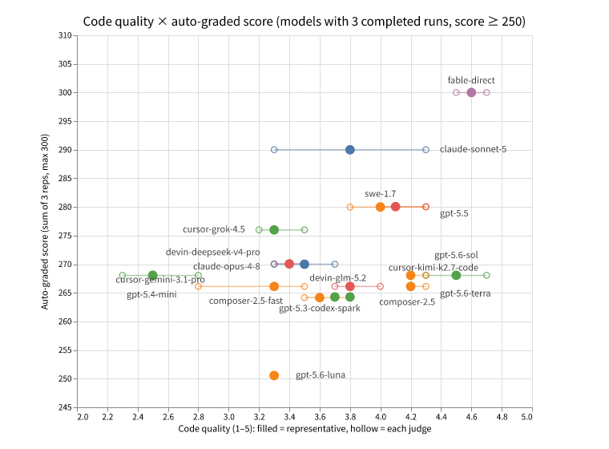
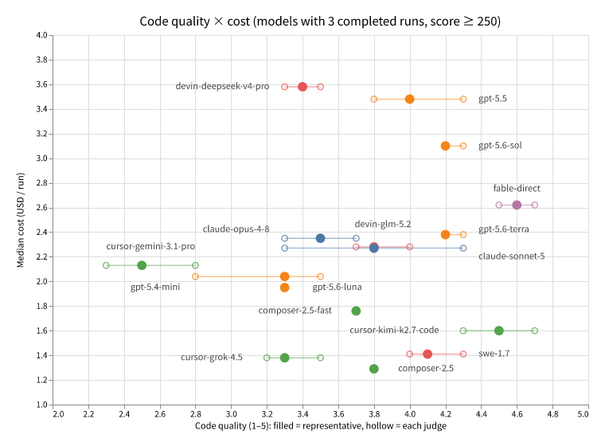

# godot-llm-gamebench

**An LLM benchmark that delegates the same Godot game implementation task to multiple vendors' CLI child models via delegate-skills, and measures the result along two axes: quality and efficiency.**

## Overview

A parent agent (Fable on Claude Code) delegates a Godot 4.x + typed GDScript implementation task to child models (Codex / Devin / Cursor / Claude) through the [`delegate-implement` skill](https://github.com/oubakiou/delegate-skills), one run per model per repetition. Each run is scored by a headless grader against hidden tests, and its wall-clock time, round trips, and token cost are recorded. The delegate-skills mechanism itself is introduced in [Don't make the expensive model do everything — "delegate-skills", a casual multi-model setup built on standard features (skills)](https://dev.to/kiou_ouba_afbd120335456f3/dont-make-the-expensive-model-do-everything-delegate-skills-a-casual-multi-model-setup-built-on-1c9j).

## What gets measured

Scoring runs on two independent axes and they are never combined into one number.

- **Quality**: a 100-point rubric, all of it auto-graded headlessly — functional correctness against hidden tests including view-behavior checks such as tick rate, mouse placement, and font-glyph coverage (70), determinism under a fixed seed (10), type-quality warnings (10), and project/scene health such as import and boot smoke tests (10).
- **Efficiency**: wall-clock time, delegation round trips, parent-side tokens, child-side tokens, and cost converted from per-model pricing (reported as N/A where pricing or measurement is unavailable).

See [docs/design/delegate_implement_bench_design.md](docs/design/delegate_implement_bench_design.md) for the full rubric, and [docs/design/bench_common_design.md](docs/design/bench_common_design.md) for the model roster and fairness/anti-cheating design. Measured results are listed under "Past benchmarks" below.

## Past benchmarks

### 202607_delegate_implement_bench (July 2026)

#### 📖 Article: [Which model should your agent outsource to? Benchmarking 18 CLI child models on the same Godot game task](https://dev.to/kiou_ouba_afbd120335456f3/which-model-should-your-agent-outsource-to-benchmarking-18-cli-child-models-on-the-same-godot-game-pa9)

The blog post covering this round's results and follow-ups.

#### 🎮 Gallery: [Play the games each model implemented, in your browser](https://oubakiou.github.io/godot-llm-gamebench/en/)

Play each model's representative run (the median-score rep) with per-run grading breakdowns.

> **Frozen round**: with this repository now public, the task prompt, hidden tests, and reference implementation for this round are exposed. The 202607 round is therefore closed as "published" — its scores will not be re-measured, and any future measurement will run as a new round with a swapped task variant. Score comparisons are only valid within a single round.

#### The task: Conveyor Courier

The benchmark task is **Conveyor Courier**, a custom tick-driven puzzle where packages flow across a grid and must be routed to the correctly colored exit by placing and rotating conveyor belts. It is an original spec (not a well-known game like Tetris) chosen to reduce contamination from prior training exposure, so that what's actually measured is the ability to read a spec and turn it into a correct implementation. The task prompt handed to child models is frozen at `benchmarks/tasks/conveyor-courier/prompt.md`, and the same byte-identical text is used for every model and every repetition. Hidden tests and the reference implementation are kept out of the child's workspace and are not described in this README.

Canonical results: [benchmarks/202607_delegate_implement_bench/impressions.md](benchmarks/202607_delegate_implement_bench/impressions.md) (Japanese — summary table, per-model notes, measurement history, follow-up A/Bs, and the judge cross-check).

#### 📊 Result scatter plots

## Bench commands

| Command                 | Description                                                            |
| ----------------------- | ---------------------------------------------------------------------- |
| `npm run bench:run`     | Run one benchmark iteration (one model × one repetition)               |
| `npm run bench:grade`   | Re-grade a workspace against the hidden tests                          |
| `npm run bench:regrade` | Re-grade every run in a round and rewrite its grade.json               |
| `npm run bench:report`  | Aggregate run results into a Markdown report                           |
| `npm run bench:export`  | Export each model's game to Web and build the browser-playable gallery |

Directory layout and development commands (setup, check / test / build) are documented in [docs/design/development.md](docs/design/development.md).

## Documentation

- [docs/design/bench_common_design.md](docs/design/bench_common_design.md) — shared benchmark foundation: model roster, execution architecture, measurement, fairness limits
- [docs/design/delegate_implement_bench_design.md](docs/design/delegate_implement_bench_design.md) — Conveyor Courier benchmark: task spec, grading, milestones
- [docs/design/development.md](docs/design/development.md) — development setup, validation commands, agent hooks

## License

MIT
