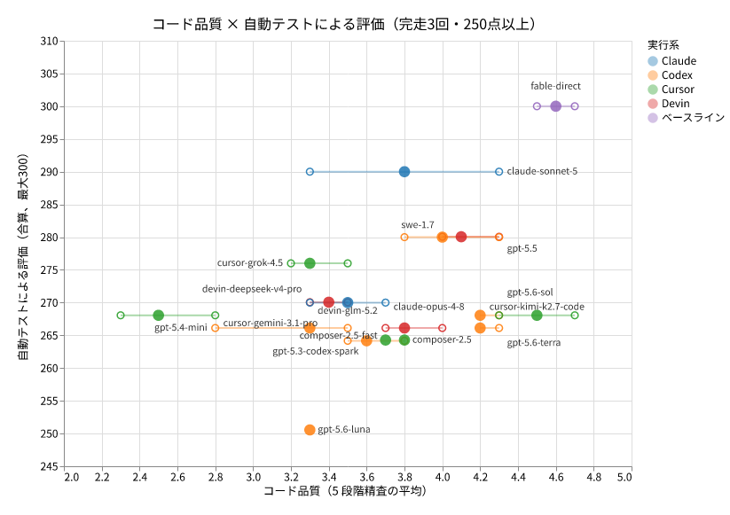
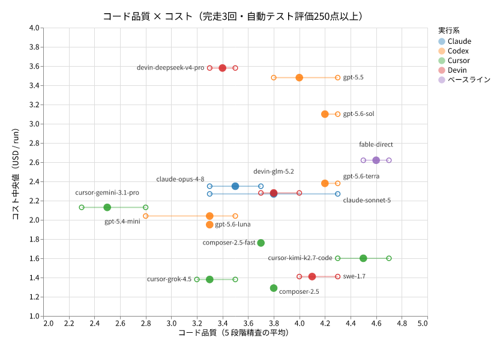

# godot-llm-gamebench

**複数社の CLI 子モデル（Codex / Devin / Cursor / Claude）に delegate-skills 経由で同一の Godot ゲーム実装課題を委譲し、品質と効率の 2 軸で計測する LLM ベンチマークである。**

## 概要

親エージェント（Claude Code 上の Fable）が [`delegate-implement` skill](https://github.com/oubakiou/delegate-skills) を使い、Godot 4.x + Typed GDScript による実装課題を子モデル（Codex / Devin / Cursor / Claude）へ委譲する。1 ラン = 1 モデル × 1 反復とし、各ランを headless な採点器で隠しテストに対して採点し、所要時間・往復回数・トークンコストを併せて記録する。

## 計測の 2 軸

採点は 2 つの独立した軸で行い、両者を 1 つのスコアに合成しない。

- **品質**: 100 点満点のルーブリックで、全項目を自動採点する。隠しテスト（tick レート・クリック設置・グリフ有無の View 挙動検査を含む）に対する機能正当性（70 点）、固定 seed 下の決定性（10 点）、型警告の少なさ（10 点）、import・起動 smoke などのプロジェクト健全性（10 点）
- **効率**: 所要時間、委譲往復回数、親側消費トークン、子側消費トークン、単価表による換算コスト（単価・実測値がない場合は N/A として報告する）

ルーブリックの詳細は [docs/design/delegate_implement_bench_design.md](docs/design/delegate_implement_bench_design.md)、対象モデル一覧と公平性・カンニング防止の設計は [docs/design/bench_common_design.md](docs/design/bench_common_design.md) を参照。計測結果は「過去に行ったベンチ」セクションを参照。

## 過去に行ったベンチ

### 202607_delegate_implement_bench（2026-07）

#### 📖 解説記事: [実装タスクを外注するモデルは何が適切なのか？GPT-5.6、Sonnet5 など、18 モデルにミニゲームを実装させるベンチマーク](https://zenn.dev/oubakiou/articles/c6c99df219465b)

本ラウンドの結果と追試をまとめたブログ記事。

#### 🎮 ギャラリー: [各モデルが実装したゲームをブラウザでプレイ](https://oubakiou.github.io/godot-llm-gamebench/)

各モデルの代表 run（採用 rep のスコア中央値）を採点内訳付きでプレイできる。

> **凍結済みラウンド**: 本リポジトリの public 化に伴い、このラウンドの課題文・隠しテスト・リファレンス実装は公開された。202607 ラウンドは「公開済み」扱いで凍結し、スコアの再測定は行わない。以後の測定はバリアントを差し替えた新ラウンドとして実施する（スコア比較は同一ラウンド内に限定）。

#### 課題: Conveyor Courier

課題は tick 駆動のパズル「Conveyor Courier」である。グリッド上を流れる荷物を、ベルトの設置・回転で正しい色の出口へ運ぶ。テトリスのような有名ゲームではなく独自仕様にすることで学習汚染を軽減し、「仕様を読んで抽象化・実装する力」そのものを測る狙いがある。子モデルへ渡す課題文の正本は `benchmarks/tasks/conveyor-courier/prompt.md` であり、全モデル・全反復で byte 一致のまま渡す。隠しテストとリファレンス実装は子モデルの作業場所には置かれず、本 README でも内容には触れない。

結果の正本: [benchmarks/202607_delegate_implement_bench/impressions.md](benchmarks/202607_delegate_implement_bench/impressions.md)（サマリー表・モデル別所感・計測の経緯・追試・判定者クロスチェック）

#### 📊 結果の散布図

## bench コマンド

| コマンド                | 説明                                                                      |
| ----------------------- | ------------------------------------------------------------------------- |
| `npm run bench:run`     | ベンチを 1 ラン実行する（1 モデル × 1 反復）                              |
| `npm run bench:grade`   | workspace を隠しテストで再採点する                                        |
| `npm run bench:regrade` | ラウンド内の全ランを再採点し grade.json を書き直す                        |
| `npm run bench:report`  | ラン結果を集計して Markdown レポートを生成する                            |
| `npm run bench:export`  | 各モデルのゲームを Web エクスポートしブラウザで遊べるギャラリーを生成する |

ディレクトリ構成と開発コマンド（セットアップ、check / test / build）は [docs/design/development.md](docs/design/development.md) を参照。

## ドキュメント

- [docs/design/bench_common_design.md](docs/design/bench_common_design.md) — 共通基盤（対象モデル、実行アーキテクチャ、計測、公平性の限界）
- [docs/design/delegate_implement_bench_design.md](docs/design/delegate_implement_bench_design.md) — Conveyor Courier ベンチ（課題仕様、採点、マイルストーン）
- [docs/design/development.md](docs/design/development.md) — 開発セットアップ、検証コマンド、エージェント hook

## ライセンス

MIT
